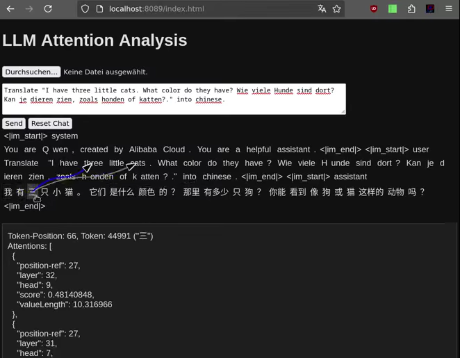

# llmvectorapi4j

Implementation of large language models in Java using the Vector API and a prototype of MCP-client and MCP-server.

This implementation is an extension of the implementation [llama3.java](https://github.com/mukel/llama3.java) by Alfonso² Peterssen which is based on Andrej Karpathy's llama2.c and minbpe projects. This extension contains:

* An internal HTTP-server to serve OpenAI-like requests.
* An optional display of important attentions. You can see which tokens the model is most interested in.
* Storing of the KV-cache into a file.

Supported models are:
* DeepSeek-R1-Distill-Qwen-1.5B-Q8_0
* Llama-3 (Llama-3.2, Llama-3.3)
* Phi-3 (CLI only, no http server)
* Qwen-2.5
* Qwen3 (non-MoE)

This project has no dependencies on other libraries. You may have a look at [LangChain for Java](https://github.com/langchain4j/langchain4j).

## MCP

The class UiServer can be used to forward, for example, function calls from a llama.cpp web server to a custom Java implementation of the function. The custom MCP tools are provided via the McpHttpServer class, and the UiServer class utilizes the McpHttpClient class to access these custom tools using the model-context-protocol (without OAuth authentication). These classes are intended for local testing, not for production use. The tools can be provided by implementing the interface org.rogmann.mcp.examples.ToolListSupplier to be used by ServiceLoader.

## Display of Attentions

If the display of attentions is enabled, the attentions with long value-vectors are displayed. In a translation from english to chinese at the token "三" the model might be interested in the english word "three" (see picture below).

Link to <a href="https://github.com/srogmann/llmvectorapi4j/raw/refs/heads/main/docs/LLM-Attention.01.webm">animation</a>:
<div align="center">
  <a href="https://github.com/srogmann/llmvectorapi4j/raw/refs/heads/main/docs/LLM-Attention.01.webm"></a>
</div>

## Usage
```
Options:
  --model, -m <path>            required, path to .gguf file
  --interactive, --chat, -i     run in chat mode
  --instruct                    run in instruct (once) mode, default mode
  --prompt, -p <string>         input prompt
  --system-prompt, -sp <string> (optional) system prompt
  --temperature, -temp <float>  temperature in [0,inf], default 0.1
  --top-p <float>               p value in top-p (nucleus) sampling in [0,1] default 0.95
  --seed <long>                 random seed, default System.nanoTime()
  --max-tokens, -n <int>        number of steps to run for < 0 = limited by context length, default 512
  --stream <boolean>            print tokens during generation; may cause encoding artifacts for non ASCII text, default true
  --echo <boolean>              print ALL tokens to stderr, if true, recommended to set --stream=false, default false
  --host <ip>                   optional ip-address of http-server (default 127.0.0.1)
  --port <port>                 optional port number of http-server (default 8080)
  --path <path>                 optional path of public-html of http-server
  --state-cache-folder          optional folder to store state-caches (to save .ggsc-files)
  --state-cache, -sc path       optional state-cache to be used (read .ggsc-file)
  --attention-trace <int>       maximum number of attentions to be traced per token
```

### Examples
Start a HTTP-server serving DeepSeek-R1-Distill-Qwen-1.5B using the web-UI of [llama.cpp](https://github.com/ggerganov/llama.cpp/):

```
java --enable-preview --add-modules jdk.incubator.vector -cp target/llmvectorapi4j-0.1.0-SNAPSHOT.jar org.rogmann.llmva4j.Qwen2 -m .../DeepSeek-R1-Distill-Qwen-1.5B-Q8_0.gguf -i --path .../git/llama.cpp/examples/server/public -n 2000
```

Start a HTTP-server serving using the internal web-UI to display attentions.

```
java --enable-preview --add-modules jdk.incubator.vector -cp target/llmvectorapi4j-0.1.0-SNAPSHOT.jar org.rogmann.llmva4j.Qwen2 -m .../qwen2.5-1.5b-instruct-q8_0.gguf -sp "You are Qwen, created by Alibaba Cloud. You are a helpful assistant." -i --attention-trace 3 --path src/main/webapp
```
